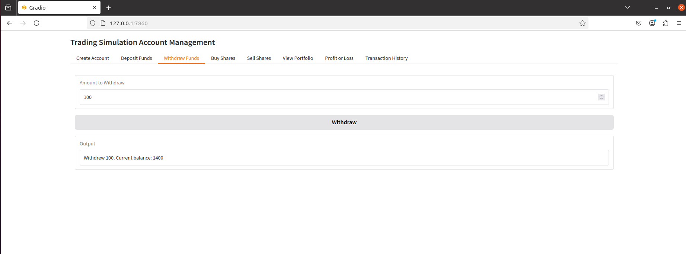
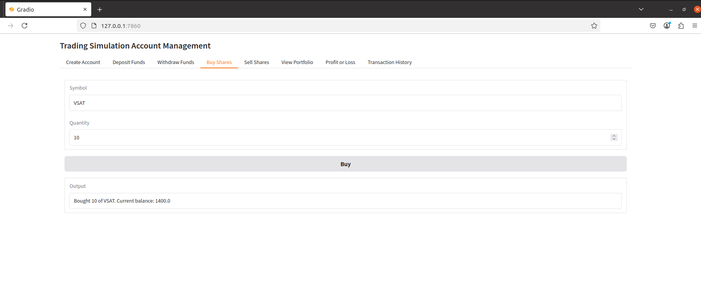
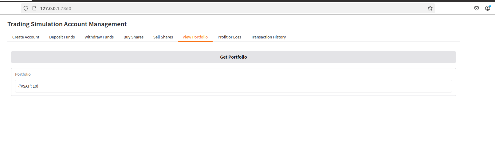
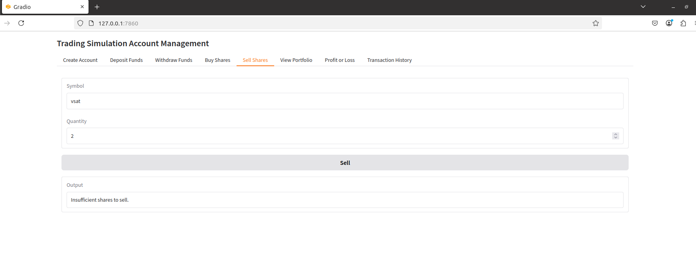

# Engineering Team CrewAI

This project uses [crewAI](https://crewai.com) to create a multi-agent AI system that simulates an engineering team. The team is composed of an engineering lead, a backend engineer, a frontend engineer, and a test engineer. Together, they work to design, code, and test a simple account management system for a trading simulation platform.

## Project Overview

The core of this project is to demonstrate how a team of AI agents can collaborate on a software development project. The project is defined by a set of requirements for an account management system, and the agents work sequentially to deliver the final product.

The project is structured as follows:

- **Engineering Lead**: Defines the project's architecture and design.
- **Backend Engineer**: Implements the backend logic for the account management system in Python.
- **Frontend Engineer**: Creates a user interface for the application using Gradio.
- **Test Engineer**: Writes and executes tests to ensure the quality of the code.

## Getting Started

Follow these instructions to get a copy of the project up and running on your local machine for development and testing purposes.

### Prerequisites

- Python >=3.10, <3.14
- [uv](https://docs.astral.sh/uv/) (Python package installer)

### Installation

1.  **Clone the repository:**

    ```bash
    git clone https://github.com/your-username/engineering-team-crewai.git
    cd engineering-team-crewai
    ```

2.  **Install `uv`:**

    ```bash
    pip install uv
    ```

3.  **Install project dependencies:**

    ```bash
    uv pip install -r requirements.txt
    ```
    or
    ```bash
    crewai install
    ```

4.  **Set up your environment variables:**

    Create a `.env` file in the root of the project and add your `OPENAI_API_KEY`:

    ```
    OPENAI_API_KEY="your-api-key"
    ```

## Running the Project

To run the engineering team and have them build the application, execute the following command from the project's root directory:

```bash
crewai run
```

This will kick off the crew, and they will start working on the tasks defined in the `src/engineering_team/crew.py` file. The output of the project, including the generated code, will be placed in the `output` directory.

### Running the Generated Application

Once the crew has finished its work, you can run the generated application using Gradio. Navigate to the `output` directory and run the `app.py` file:

```bash
cd output
crewai add gradio 
crewai run  app.py
```

This will start a local web server, and you can interact with the application through your browser.

## Generated web application

Below are screenshots of the generated web application and its features:

### Create Account


### Deposit More Funds


### Withdraw Some Amount


### Buy Shares


### View Portfolio


### Transaction History


### Bug: Selling Shares



## Customization

You can customize the agents, tasks, and the overall behavior of the crew by modifying the following files:

-   `src/engineering_team/config/agents.yaml`: Define the properties of each agent.
-   `src/engineering_team/config/tasks.yaml`: Define the tasks that the agents will perform.
-   `src/engineering_team/crew.py`: Modify the crew's structure, add new agents, or change the process flow.
-   `src/engineering_team/main.py`: Change the inputs for the crew, such as the project requirements.

## Support

For support, questions, or feedback, please refer to the official crewAI resources:

-   [Documentation](https://docs.crewai.com)
-   [GitHub Repository](https://github.com/joaomdmoura/crewai)
-   [Discord Community](https://discord.com/invite/X4JWnZnxPb)